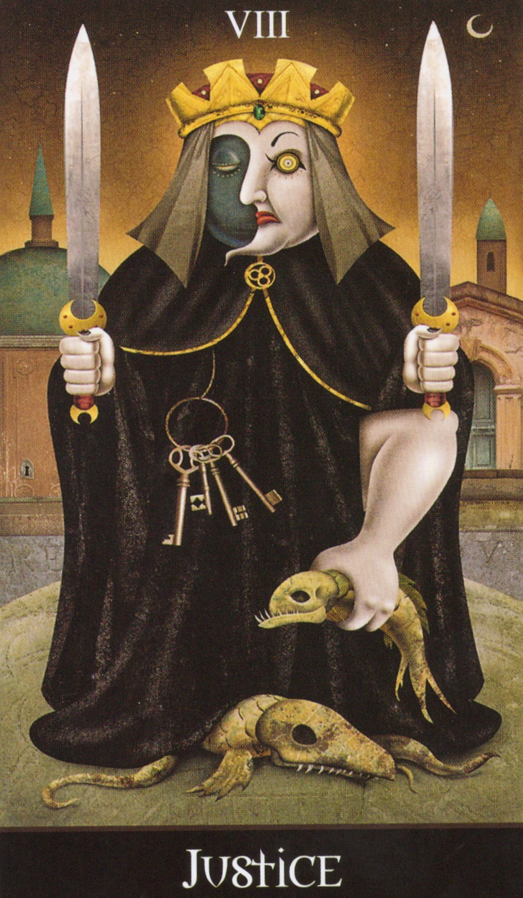

# 🔑 過去の判断を解放するパスワーキング（Justiceとともに）

この内的ワークは、Deviant Moon Tarot の《Justice（正義）》のカードを、十字路の女神ヘカテの象徴として用いるパスワーキングです。

「過去の判断に対して、自分を責めるでもなく、正当化するでもなく、ただ“見る”こと」「そして、必要であれば許し、手放すこと」を目的としています。

このワークでは、夜の十字路にヘカテが《Justice》の姿で現れ、「あれでよかったのか？」と問いかけてきます。

---

## 🌒 導入（Opening）

目を閉じて、深く呼吸してください。
三日月が照らす夜道を歩いている自分を想像します。
静かな十字路に出ると、中心に黒いローブをまとった背の高い人物──Justiceの姿をしたヘカテが立っています。

彼女は両手に剣を持ち、あなたの方へ向き直ってこう語ります：

> "You have come far. But there is something behind you that still weighs on your path."
> 
> 「あなたはここまで来た。でも、後ろに置いてきた何かが、まだ足取りを重くしている。」
>
> "Let me ask you: Was it the right decision?"
>
> 「問います──あの判断は、正しかったのか？」

---

## ⚖️ 二本の剣：左脳と右脳の問い

ヘカテは左手を上げます。理性と明晰さの剣です。

> "Look at it with your left brain: What were the facts? Why did you choose that path?"
>
> 「左脳で見てください：事実は何でしたか？ なぜその道を選んだのですか？」

次に彼女は右手を上げます。直感と記憶の剣です。

> "Now, with your right brain: What did you feel? What shadows were guiding you then?"
>
> 「今度は右脳で：どんな感情がありましたか？ 当時、何があなたを導いていたのでしょう？」

---

## 🔓 許しと解放（Judgment and Release）

彼女は剣を下ろし、あなたの目をまっすぐ見つめます。

> "No judgment. No punishment. Only truth."
> 
> 「裁きはありません。罰もありません。ただ真実だけです。」
>
> "If you were merely silent—let yourself speak."
>
> 「もし、あなたがただ沈黙していたのなら──今こそ、声を出してください。」
>
> "If you were only surviving—let yourself be seen."
>
> 「もし、あなたがただ生き延びていたのなら──今こそ、あなた自身を認めてください。」

ヘカテはマントを開き、銀の鍵を差し出します。

> "This is yours. Take it, and open the gate of release."
>
> 「これはあなたのものです。受け取りなさい。そして、解放の扉を開けて。」

---

## 🚪 扉をくぐる（Closing）

あなたは鍵を受け取り、彼女の背後にある扉を開きます。

一歩、前へ。手放しましょう。
その重荷を、もう背負う必要はありません。

---

🃏 使用カード：Justice（Deviant Moon Tarot）

🕯️ このワークは内的な儀式です。特別な道具は不要ですが、Justiceカードを前に置いたり、キャンドルを灯したり、ワーク後に日記をつけることもおすすめです。

---

© 2025 知られざる呪術師（Le Sorcier Inconnu）  
本ドキュメントは [Creative Commons BY-SA 4.0](https://creativecommons.org/licenses/by-sa/4.0/deed.ja) に基づき公開されています。
